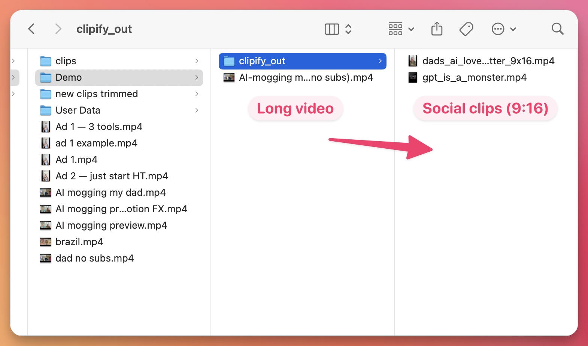

# Clipify

A [Claude Code](https://claude.com/claude-code) skill that turns long videos into social-ready clips.

https://github.com/louisedesadeleer/clipify/releases/download/v0.1.0/clipify_demo.mp4



Point it at any video file and it will:

1. **Find clip-worthy segments** — transcribes the video with [Whisper](https://github.com/openai/whisper) and scans the transcript for punchlines, reversals, awkward pauses, and audio peaks to propose 3–5 candidates.
2. **Create a 9:16 clip** — cuts your chosen moment, then reframes 16:9 → 9:16 with hard-cut pans that follow whoever is speaking (or split-screen if you'd rather see both faces).
3. **Add subtitles** — burns opus-style word-by-word captions (big bold white, yellow active-word highlight).

No cloud APIs. Runs entirely on your machine. No OpenCV. ~20s of work for a 20s clip on Apple Silicon.

## Why this exists

Most "auto-clip" tools are either expensive SaaS, slow, or produce slop. This skill is what I actually use to clip my long-form videos for LinkedIn and TikTok. Built for talking-head dialogue (interviews, podcasts, two-person setups).

## Requirements

- macOS (uses VideoToolbox for hardware-accelerated decode — works on Linux/Windows if you remove `-hwaccel videotoolbox` flags)
- [Claude Code](https://claude.com/claude-code)
- `ffmpeg` with `libx264` (`brew install ffmpeg`)
- [`whisper`](https://github.com/openai/whisper) (`pip install openai-whisper`)
- Python 3 with `numpy` (`pip install numpy`)

## Install

```bash
git clone https://github.com/louisedesadeleer/clipify.git ~/.claude/skills/clipify
```

That's it. Restart Claude Code and `/clipify` is available as a slash command.

## Usage

In Claude Code:

```
/clipify
```

Then paste a video file path when asked. The skill will:

1. Transcribe → propose 3–5 funny candidate clips with timestamps and titles
2. Ask which to cut
3. Ask 9:16 / 16:9 / 1:1
4. If 9:16 from 16:9 with two faces: ask pan vs split-screen
5. Ask subtitle style (opus / karaoke / minimal — or paste a reference image to match)
6. Render and open the result

Final clips land in `<source-video-dir>/clipify_out/`.

## How the face-pan works

No face detection model. Camera is static within a single clip, so:

1. Eyeball each face's mouth+chin area as a rectangle on one sample frame.
2. ffmpeg computes per-frame motion energy in each rectangle using frame differencing.
3. Whichever rectangle has more motion at a given moment = that's the speaker.
4. Build a hard-cut x-coordinate expression from the speaker timeline.
5. Crop a vertical strip from the source that follows whoever's talking.

Total cost: a few seconds of ffmpeg per clip. Works surprisingly well.

## Repo structure

```
clipify/
├── SKILL.md           # the skill prompt Claude Code reads
├── scripts/
│   ├── analyze.py     # speaker timeline from two ROI motion files
│   ├── build_pan.py   # ffmpeg crop x-expression with hard cuts
│   ├── build_ass.py   # opus/karaoke/minimal ASS captions from whisper JSON
│   └── audio_align.py # find offset of a sub-clip in a longer source
└── README.md
```

## License

MIT — see [LICENSE](LICENSE).

Built by [Louise de Sadeleer](https://github.com/louisedesadeleer), Growth at [Tella](https://tella.tv).
